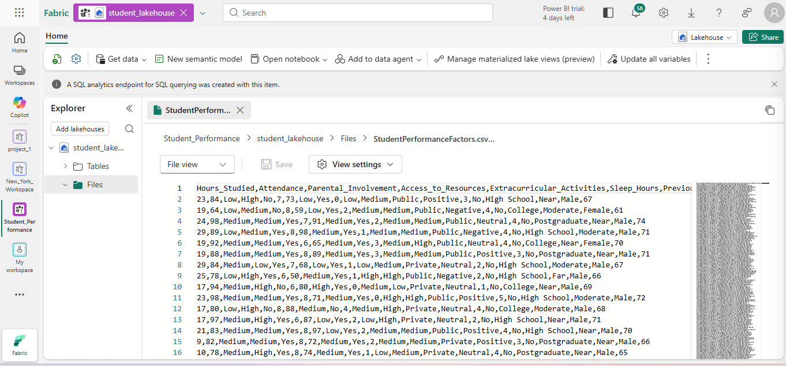
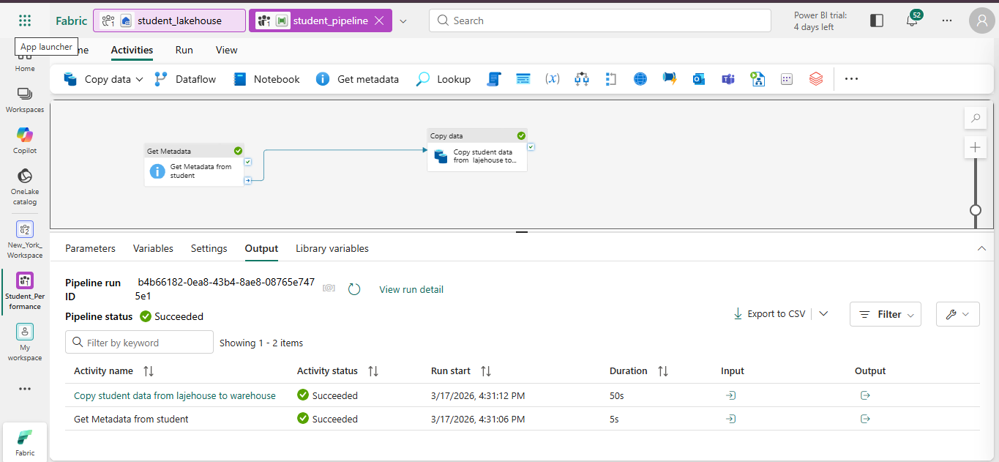
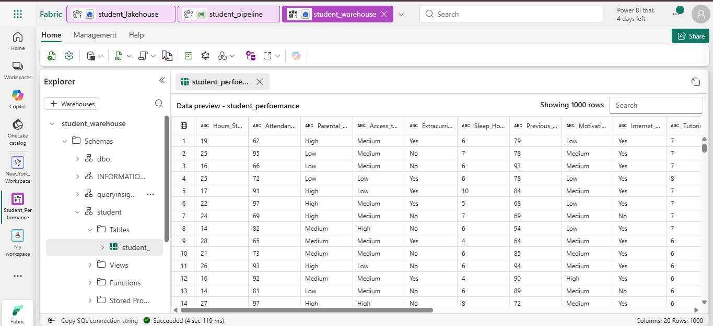
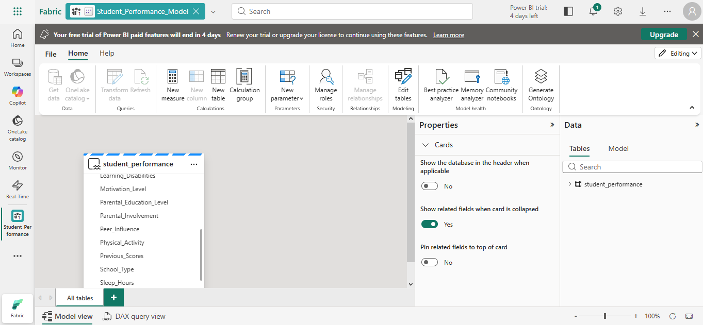

# Medallion-Architecture
This pipeline demonstrates a Medallion Architecture workflow in Microsoft Fabric, moving from raw ingestion to processed data and finally to semantic models for reporting

## Workflow Overview

### 1️⃣ Lakehouse
ingestion of the raw data into fabric

### 2️⃣ Pipeline
building of pipelines

### 3️⃣ Data Warehouse
loading of the structured data into the data warehouse

### 4️⃣ Semantic Model
creating a semantic model to be used for visualization in Power BI

# 📌 Data Concepts Covered
  
  
  
  

